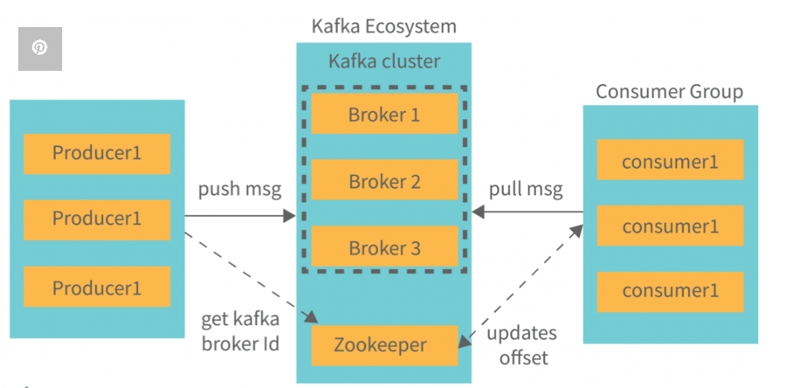
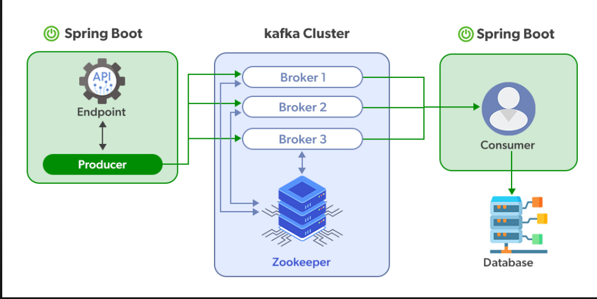

# Kafka-Based API Communication (Theory)

## 1. Decoupling of Services
In Apache Kafka, services do not communicate directly.  
The producer (API 1) sends messages to Kafka, and the consumer (API 2) reads them independently.  
This removes tight coupling between services.

---

## 2. Event-Driven Architecture
Kafka follows an event-driven model where communication happens through events.  
Example: "Order Created" event is published and multiple services can react to it.

---

## 3. Asynchronous Communication
Kafka enables asynchronous communication.  
The producer sends data without waiting for a response from the consumer, improving performance.

---

## 4. High Throughput
Kafka is designed to handle a large volume of data.  
It can process millions of messages per second, making it suitable for real-time systems.

---

## 5. Fault Tolerance
Kafka stores messages in topics with replication.  
If a consumer or broker fails, data is not lost and can be processed later.

---

## 6. Scalability via Partitions
Topics in Kafka are divided into partitions.  
This allows multiple consumers to process data in parallel, improving scalability.

---

## 7. Consumer Groups
Kafka uses consumer groups to distribute workload.  
Each message is consumed by only one consumer within a group, enabling load balancing.

---

## 8. Data Persistence and Replay
Kafka retains messages for a configured time period.  
Consumers can reprocess (replay) messages if needed for debugging or recovery.

---

## 9. Loose Coupling for Microservices
Kafka enables loosely coupled microservices architecture.  
Services can be added, removed, or updated without impacting other components.

---

## 10. Real-Time Stream Processing
Kafka supports real-time data streaming and processing.  
It can integrate with tools like Spark or Elasticsearch for analytics and monitoring.

---
